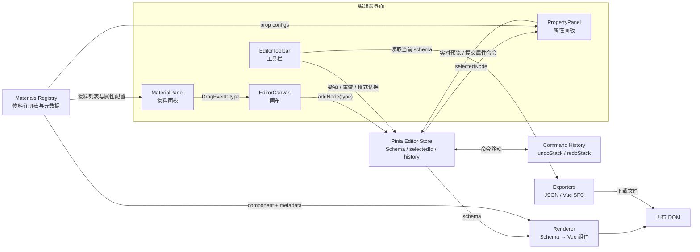

# Lowcode Editor

一个基于 Vue 3、TypeScript 和 Pinia 实现的低代码可视化编辑器 MVP。

项目使用 Schema 作为画布的单一数据源，通过物料注册表和动态组件完成渲染，并使用命令模式实现添加、删除、移动、属性修改等操作的撤销与重做。

在线 Demo：[https://jing-momo.github.io/lowcode-editor/](https://jing-momo.github.io/lowcode-editor/)

## 已实现功能

- 三栏编辑器布局：物料区、画布区、属性配置区
- 文本、按钮、图片 3 种基础物料
- 基于物料元数据动态生成属性表单
- 使用 HTML5 Drag API 将物料拖入画布
- Schema 驱动的动态组件渲染
- 组件选择、删除和上下移动
- 属性实时预览
- 添加、删除、移动和属性修改的撤销/重做
- 编辑模式与预览模式切换
- 导出当前 Schema JSON
- 将 Schema 生成并导出为 Vue SFC
- 1000 个文本节点性能测试入口
- Vitest 核心逻辑单元测试

> `ComponentSchema` 已预留 `children`，Renderer 也支持递归渲染，但当前版本尚未实现容器物料和嵌套编辑能力。

## 技术栈

| 技术           | 用途                                    |
| -------------- | --------------------------------------- |
| Vue 3          | 组件系统、动态组件和响应式渲染          |
| TypeScript     | Schema、物料元数据和编辑器 API 类型约束 |
| Pinia          | 管理 Schema、选中状态和命令历史         |
| Vite           | 开发服务器与项目构建                    |
| Vitest         | 纯函数和 Pinia Store 单元测试           |
| HTML5 Drag API | 物料拖入画布                            |
| pnpm           | 依赖管理                                |

## 快速开始

### 已验证环境

- Node.js 24
- pnpm 11
  其他满足 Vite 8 与 Vitest 4 要求的 Node.js 版本也可能正常运行，具体以依赖声明为准。

### 安装依赖

```bash
pnpm install
```

项目使用 `pnpm-lock.yaml`，请勿混用 npm 或 yarn。

### 启动开发环境

```bash
pnpm dev
```

默认访问：

```text
http://localhost:5173
```

### 运行测试

```bash
pnpm test
```

当前共有 3 个测试文件、11 条测试用例。

### 类型检查与构建

```bash
pnpm build
```

该命令会先执行 Vue/TypeScript 类型检查，再进行生产构建。

## 核心数据模型

画布由 `ComponentSchema[]` 描述：

```ts
interface ComponentSchema {
  id: string;
  type: string;
  props: Record<string, any>;
  children?: ComponentSchema[];
}
```

示例：

```json
{
  "id": "1",
  "type": "text",
  "props": {
    "text": "我是画布上的文字",
    "color": "#e63946",
    "fontSize": 20
  }
}
```

字段职责：

- `id`：节点唯一标识，也是列表渲染的 `key`
- `type`：从物料注册表中查找对应组件
- `props`：组件渲染和属性面板使用的配置
- `children`：为容器物料和递归渲染预留

## 总体架构



## 核心数据流

### 从物料面板拖入组件

```text
MaterialPanel
→ dragstart 将物料 type 写入 DataTransfer
→ EditorCanvas 在 drop 时读取 type
→ editor.addNode(type)
→ 根据物料元数据生成默认 props
→ 创建 ComponentSchema
→ 写入 Pinia schema
→ Renderer 自动更新画布
```

拖拽事件只传递物料 `type`，没有携带整份物料对象。Store 根据注册表重新获取物料元数据，避免拖拽数据冗余，并保持物料定义的单一来源。

### 修改组件属性

```text
点击画布节点
→ selectedId 更新
→ selectedNode 自动计算
→ PropertyPanel 根据物料元数据生成表单
→ input 事件实时更新 props
→ change 事件提交一条属性命令
→ Renderer 更新对应节点
```

属性编辑使用一次编辑会话聚合历史：

- `focus`：记录修改前的值
- `input`：实时预览，但不写入撤销栈
- `change`：将整次编辑提交为一条命令

这样既保留实时预览，也避免用户每输入一个字符就产生一条撤销记录。

架构中的核心职责：

- 物料注册表决定“能用什么”
- Schema 决定“画布上有什么”
- Renderer 决定“如何渲染”
- Store 决定“如何修改和回退”

## 关键设计与取舍

### Schema 作为单一数据源

画布不直接维护独立的 DOM 状态，所有节点都保存在 Pinia 的 `schema` 中。Renderer 只根据 Schema 和物料注册表生成界面。

这样可以保证：

- 属性面板、画布和导出器读取同一份数据
- 增删改移最终都收敛为 Schema 变化
- 撤销与重做不需要直接操作 DOM
- JSON 和 Vue SFC 导出都能读取当前真实画布状态

### 命令模式实现撤销与重做

编辑器维护两个历史栈：

```text
执行新命令：
execute
→ push undoStack
→ clear redoStack

撤销：
pop undoStack
→ command.undo()
→ push redoStack

重做：
pop redoStack
→ command.execute()
→ push undoStack
```

每个命令保存执行和回退所需的最小信息。例如删除命令保存被删除节点、原下标和删除前的选中状态。

相比每次操作都深拷贝完整 Schema：

| 方案     | 优点                           | 缺点                                     |
| -------- | ------------------------------ | ---------------------------------------- |
| 全量快照 | 实现简单，恢复直接             | Schema 较大时内存与复制成本高            |
| 命令模式 | 只记录操作所需数据，扩展性更强 | 每种操作都要正确实现 `execute` 和 `undo` |

当前版本选择命令模式，但尚未实现历史栈长度限制。生产场景需要增加最大栈深度或内存预算。

### `key` 与 `v-memo`

Renderer 使用节点 `id` 作为 `key`，保证列表移动时 Vue 能识别节点身份并复用 DOM。

1000 个节点场景下进一步使用：

```vue
v-memo="[ item.props, editor.selectedId === item.id, editor.isPreview, ]"
```

两者职责不同：

- `key`：解决“这个节点是谁”
- `v-memo`：解决“依赖未变化时是否可以跳过更新”

属性修改会替换 `item.props` 对象，因此 `v-memo` 依赖 `item.props`，不能只依赖引用保持不变的 `item`。

### 为什么当前没有使用 `markRaw`

物料注册表目前是模块顶层的普通对象，没有存入 `reactive`、`ref` 或 Pinia state，因此组件定义不会被 Pinia 深度代理。

在当前架构中添加 `markRaw` 没有明确收益。如果未来把物料注册表改为响应式动态注册，再考虑：

- 对组件定义使用 `markRaw`
- 或使用 `shallowRef`、`shallowReactive` 管理注册表

### Vue 代码导出与安全边界

Vue 导出器按照节点 `type` 将 Schema 转换为模板字符串：

```text
ComponentSchema[]
→ renderNode
→ Vue template string
→ Blob
→ Object URL
→ 下载 .vue 文件
```

用户输入在进入 Vue 模板前会转义：

```text
& → &amp;
< → &lt;
> → &gt;
" → &quot;
' → &#39;
```

其中必须先转义 `&`，避免后续生成的 HTML 实体被重复转义。未知物料只输出固定注释，不把未知 `type` 写入模板。

## 项目结构

```text
src/
├── components/
│   ├── EditorCanvas.vue       # 画布与 drop 入口
│   ├── EditorToolbar.vue      # 历史、模式、导出和性能入口
│   ├── MaterialPanel.vue      # 物料列表与 dragstart
│   ├── PropertyPanel.vue      # 动态属性表单与编辑会话
│   └── Renderer.vue           # Schema 递归渲染
├── materials/
│   ├── MButton.vue            # 按钮物料
│   ├── MImage.vue             # 图片物料
│   ├── MText.vue              # 文本物料
│   ├── index.ts               # 物料注册表与元数据
│   └── types.ts               # Schema 和物料类型
├── stores/
│   ├── editor.ts              # 编辑器状态与命令历史
│   └── editor.test.ts         # Store 单元测试
├── utils/
│   ├── createBenchmarkSchema.ts
│   ├── createBenchmarkSchema.test.ts
│   ├── downloadFile.ts
│   ├── generateVueCode.ts
│   └── generateVueCode.test.ts
├── App.vue
└── main.ts
```

## 测试

项目使用 Vitest 测试纯函数和 Pinia Store 公开行为。

当前测试结果：

```text
Test Files  3 passed
Tests       11 passed
```

覆盖范围：

- 基准 Schema 数量、稳定 ID 和调用隔离
- 文本、按钮和图片的 Vue 代码生成
- HTML 特殊字符转义与未知物料安全边界
- 添加节点的执行、撤销、重做和 ID 复用
- 删除节点后恢复原下标和选中状态
- 节点移动、撤销、重做和边界无效操作
- 属性修改的撤销与重做
- 撤销后执行新命令清空 redo 分支

Store 测试在每条用例前创建新的 Pinia，避免 Schema 和命令历史互相污染。

## 性能验证

在开发环境中构造 1000 个文本节点，使用 Chrome Performance 面板记录选择、滚动和属性修改操作。

| 指标 | 使用 `v-memo` 前 | 使用 `v-memo` 后 |
| ---- | ---------------: | ---------------: |
| INP  |             71ms |             62ms |
| CLS  |                0 |                0 |

这是一组本机单次观测。由于两次录制区间和运行环境可能存在差异，不能据此宣称稳定提升固定百分比。

当前结论是：

- 1000 个简单节点下交互保持流畅
- `v-memo` 没有造成功能回退
- 当前证据不足以支持引入复杂虚拟列表
- 如果未来出现万级节点或更复杂组件，应重新建立同条件基线再决定优化方案

## 当前限制

- 只有文本、按钮、图片 3 种基础物料
- 尚未实现容器物料和嵌套编辑
- 只支持从物料区拖入，尚未支持画布内自由拖拽排序
- 撤销与重做历史栈尚未限长
- Vue 导出器只覆盖当前 3 种物料
- 尚未实现 Schema 运行时校验和版本迁移
- HTML5 Drag API 不直接支持移动端触摸操作

## 自动部署

推送到 `main` 分支时，GitHub Actions 会依次安装依赖、运行测试、执行生产构建，并在全部通过后将 `dist` 发布到 GitHub Pages。也可以在 Actions 页面手动触发部署。

## Roadmap

- [ ] 增加输入框、卡片和容器物料
- [ ] 完成嵌套 Schema 的编辑能力
- [ ] 支持画布内拖拽排序和插入位置提示
- [ ] 为历史栈增加最大长度或内存预算
- [ ] 增加 Schema 运行时校验与版本号
- [ ] 增加组件级测试和浏览器 E2E
- [ ] 使用 Pointer Events 支持移动端
- [x] 配置 CI 和 GitHub Pages 在线 demo
- [ ] 补充演示 GIF
